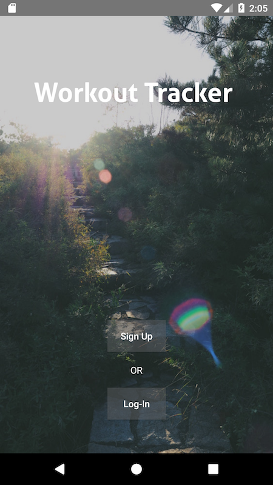
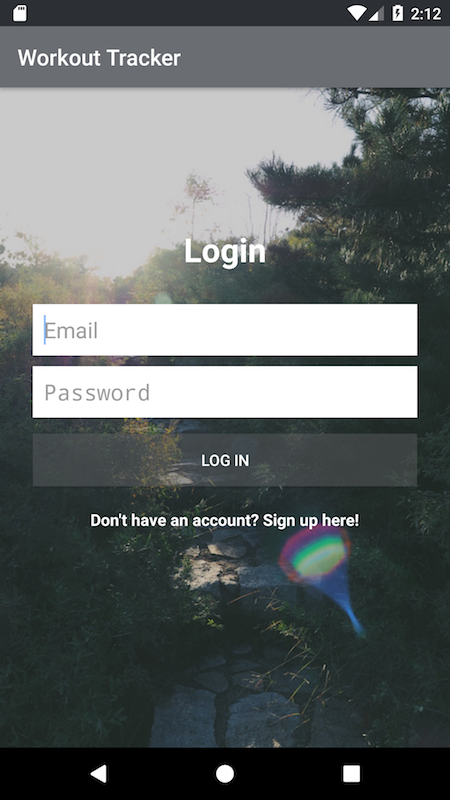
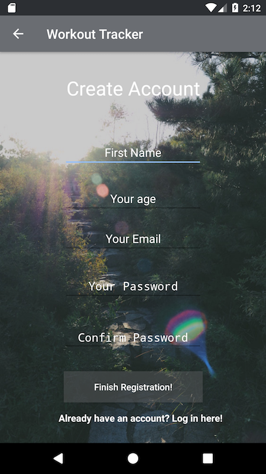
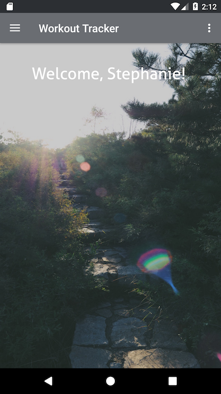
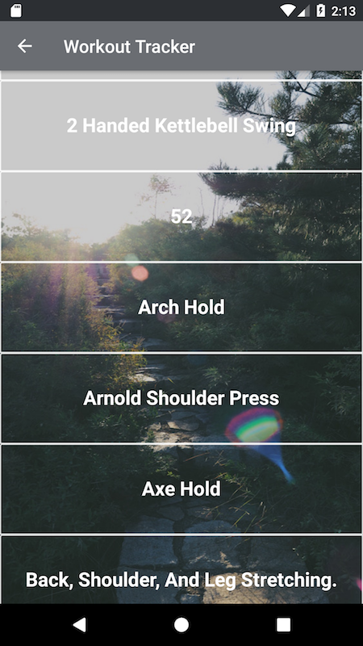
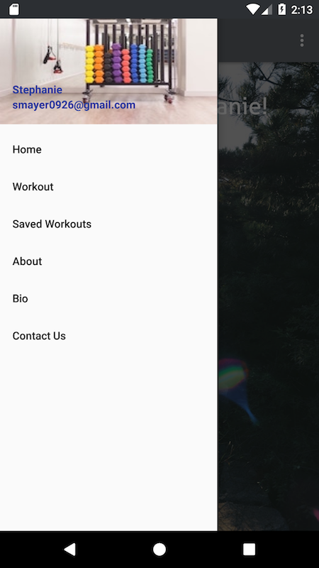

# Workout Tracker

#### Epicodus Friday Project

#### By Stephanie Mayer

## Table Of Contents

* [Description](#description)
* [View Of Application](#view-of-application)
* [Set-Up Requirements](#setup-requirements)
* [Specifications](#specifications)
* [Questions or Concerns](#questions-or-concerns)
* [Known Bugs](#known-bugs)
* [Technologies Used](#technologies-used)

## Description

_This application will allow a user to find specific workouts and save those workouts. The user will then be able to retrieve those workouts at a later time when they may want to use them. Some of the workouts include links to videos that may help them learn the proper workout._


## View Of Application














## Setup Requirements
_To use this project, you will need to make sure to install Android Studio._
* [Android Studio](https://developer.android.com/studio/index.html)
* Once installed, you will be able to open the application.

_To use this application, you will need to generate an API Key_
* You will need to get an API Key from
  * [Wger](https://wger.de/en/software/api)
  * Click on the button that says "Generate API KEY"
  * All documentation on how to use the API is also present there.

* Clone the repo from git hub using:
````
$ git clone https://github.com/smayer0926/Android-Friday-Project.git
````
* Open the application in Android Studio.
* Experiment!


* Open in your favorite emulator.

## User Stories
* As a user, I want to be able to create an account for the application.
* As a user, I want to be able to login to an account that was previously created.
* As a user, I want to be able to find workouts that could help improve my daily workout.
* As a user, I want to be able to look at the latest of information that there is when it comes to diet. (Not yet functional)


## Questions or Concerns ##
_If there are any questions or concerns, please contact me at smayer0926@gmail.com_

## Known Bugs

* No known bugs at this time.


## Technologies Used

* _Android Studio_
* _Atom_
* _Postman_


### License

Copyright &copy; 2017 Stephanie Mayer
